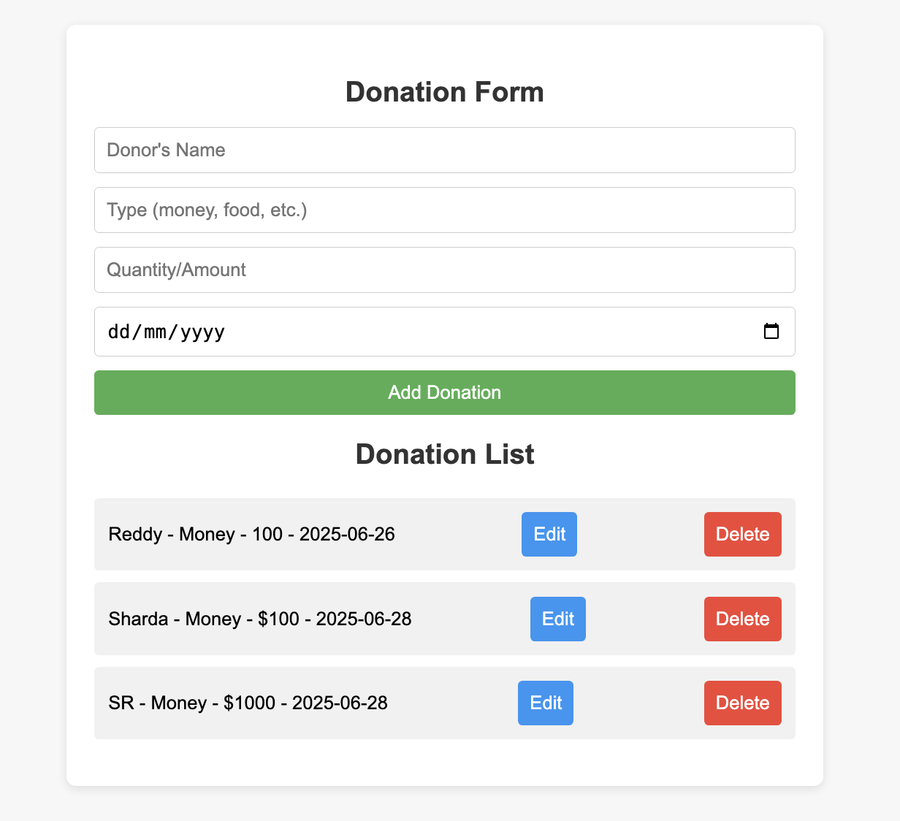

# 🧾 Donation Inventory App

This is a simple full-stack web application built for a local shelter to manage incoming donations. It allows users to **add**, **edit**, **delete**, and **view** donation entries such as money, food etc.

## 📦 Tech Stack

- **Frontend**: React + Vite
- **Backend**: Express.js
- **Data Storage**: In-memory
- **Styling**: Custom CSS

---

## ✨ Features

- Donation form with donor name, type(Money,food), quantity/Amount, and date
- Editable list of donations
- Instant UI updates on add/edit/delete
- Backend API with full CRUD support
- Fully responsive and centered UI

---

## 📸 Screenshot



---
## 🛠️ Installation & Running the App

### 1. Clone the repository

```bash
git clone https://github.com/shardareddy12/Donation_Page.git
cd Donation_Page
```
---

### 2. Run Backend
```bash
node src/server.js
```
- App.jsx uses http://localhost:5001 in all axios calls.
---
### 3. Run Frontend
```bash
npm run dev
```
- Visit the app at: http://localhost:5173

